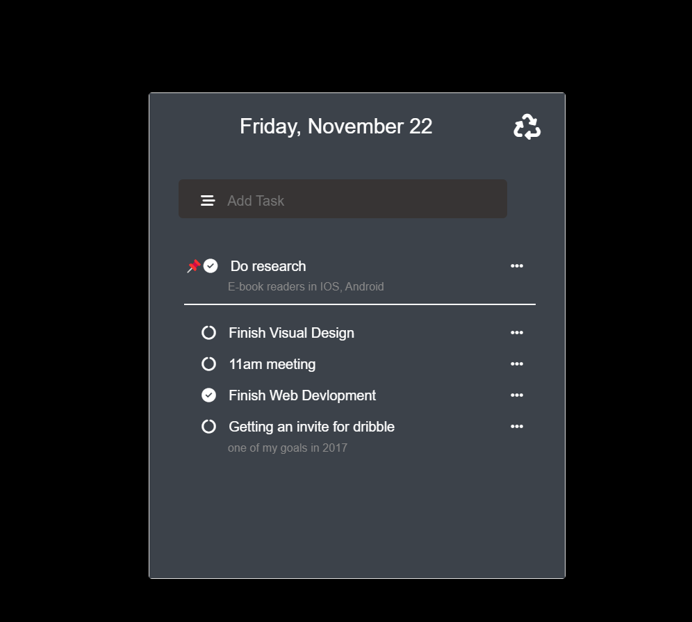

### Task Manager Project

#### Description
This is a **Task Manager Application** designed to help users efficiently manage their daily tasks. The project includes several features such as adding, editing, pinning, and deleting tasks. Additionally, it allows users to organize tasks with memos and prioritize them by pinning important ones at the top.

---

#### Features
1. **Add Tasks**  
   Users can add tasks to their to-do list by typing in the input field and pressing the *Enter* key. The tasks are stored locally in the browser's `localStorage`.

2. **Mark Tasks as Completed**  
   Tasks can be marked as complete or incomplete by clicking on a circular icon.

3. **Pin and Unpin Tasks**  
   Users can prioritize tasks by pinning them to the top of the list. The pinned tasks are visually distinct with a 📌 icon.

4. **Add Memos**  
   Each task can have a memo for additional notes or details. The memos are displayed below the task in a styled format.

5. **Delete Tasks**  
   Tasks can be removed from the list by using the delete option.

6. **Task Organization**  
   - Pinned tasks are displayed at the top, separated by a visual line.
   - Regular tasks are displayed below the pinned tasks.

7. **Local Storage Integration**  
   All tasks, their states (pinned, completed, etc.), and memos are stored in the browser's `localStorage`, ensuring data persistence across sessions.

8.  **Refresh Option**  
    A refresh button clears all tasks from `localStorage` and reloads the page for a fresh start.

---

#### Technology Stack
- **HTML5**: For structuring the application.
- **CSS3**: For styling and responsiveness.
- **JavaScript (ES6)**: For dynamic functionality and local storage management.
- **Font Awesome**: For icons and UI enhancement.

---

#### Preview

